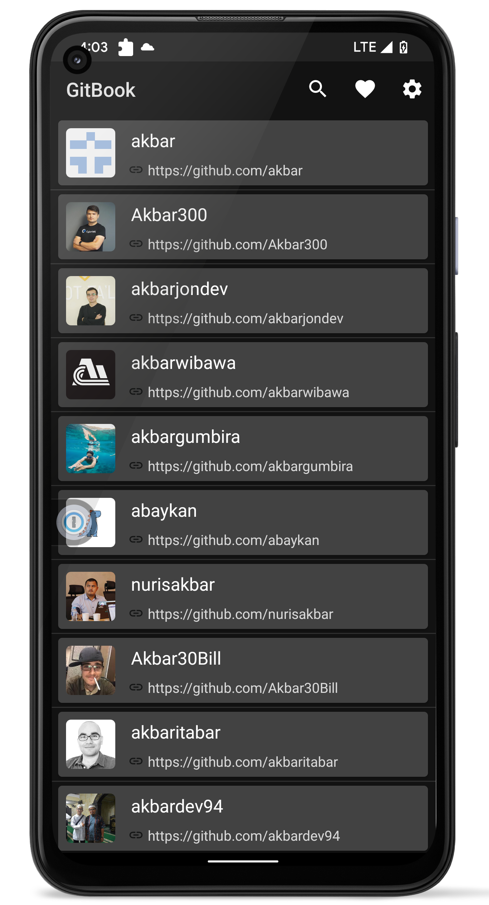
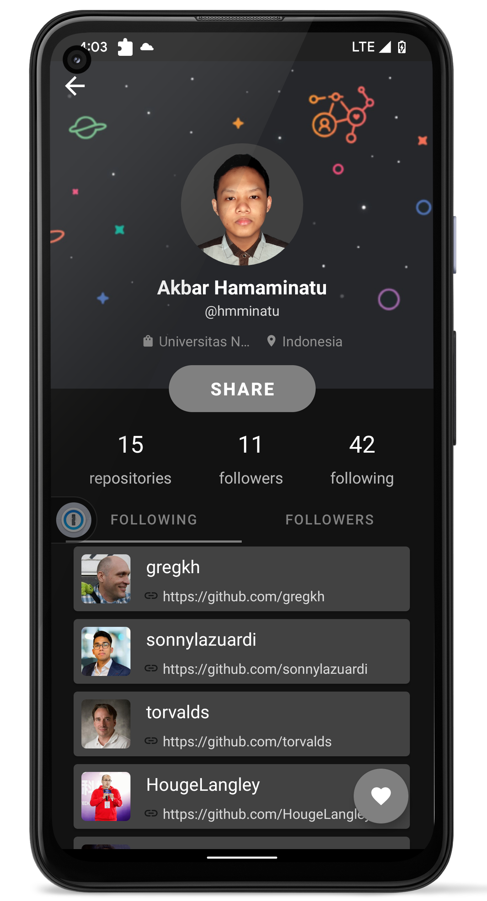
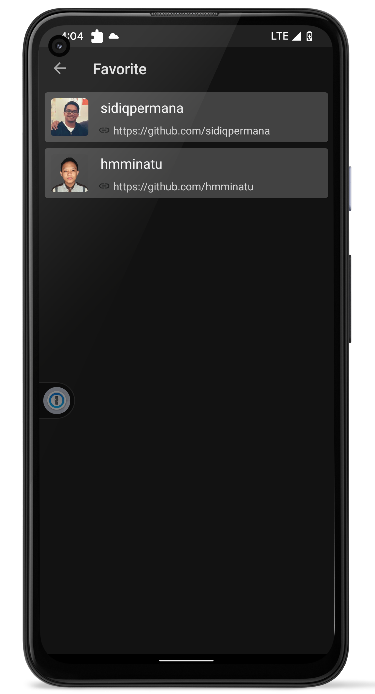
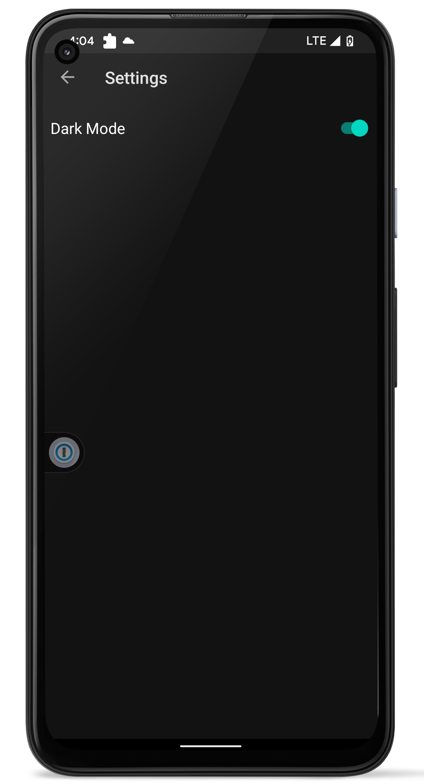

# GitBook

GitBook is a GitHub user application that can retrieve data from a Web API and store favorite data using a local database.

## 🏗️ How to run GitBook
- Clone this repository
```bash
git clone https://github.com/akbarhmu/GitBook
```
- Open cloned folder in Android Studio
- Generate GitHub personal access token at [here](https://github.com/settings/tokens)
- Add your personal access token in local.properties
```
GITHUB_TOKEN=<your_token>
```
- Set GitHub API base url in local.properties
```
BASE_URL=https://api.github.com
```
- Run application

## ✨ List of Features 
- List and search GitHub users
- GitHub user detail
- Settings
  - Dark theme switch
- Add users to favorite and delete from favorite
  
## 🛠 Tech Stacks
- Kotlin (Programming Language)
- Room (Layer build on top of SQLite)
- MVVM (Architecture)
- Retrofit (Network Library)
- Glide (Image Loading Library)
- Data Store
- Mockito & Espresso (Unit & UI Testing)

## 📸 Screenshoots

<p align="center">
    
    
    
    
</p>

<p align="center">
Detail profile page is designed by <a href="https://dribbble.com/shots/8088258-Github-Profile-Redesign">Junn Studio's Github Profile Redesign on dribble</a>.
</p>